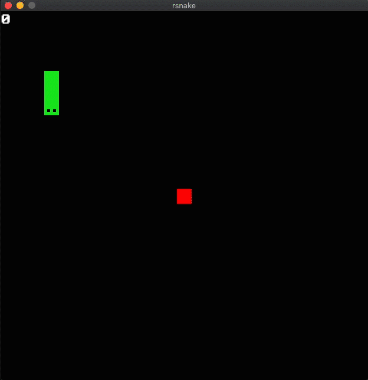

# Rsnake

<div style="display: flex; justify-content: center;">

</div>

---

```zsh
# 运行
cargo run

# 构建执行程序并执行
cargo build --release
./target/release/rsnake
```

[学习地址](https://github.com/mara214/rsnake)
